# 均值-方差投资组合：矩阵算法、解析解与样本外实验

> Markowitz mean–variance portfolio optimization, built from scratch (NumPy-only) and studied from a **matrix-algorithms** viewpoint — then stress-tested out-of-sample.

[](https://github.com/hhzz-svg/mean-variance-portfolio/actions/workflows/ci.yml)


**🌐 语言**：中文（本文） · **[English](README_EN.md)** ｜ **📓 [总览 Notebook](overview.ipynb)**（一个文件读完七幕）

<p align="center">
  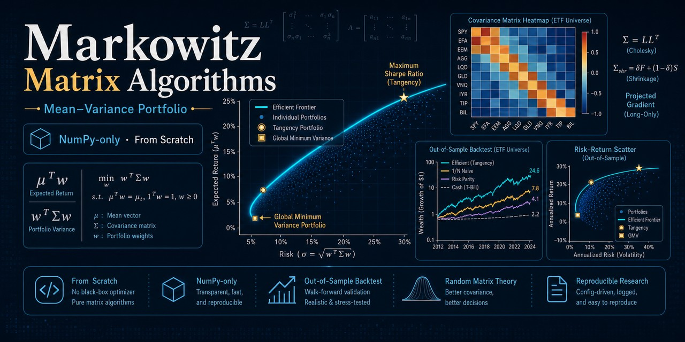
</p>

把量化金融最经典的资产配置问题 —— **Markowitz 均值-方差模型** —— 建成一个**双目标规划**
（同时 `max μᵀw` 收益、`min wᵀΣw` 风险），从**矩阵算法**视角完整求解，再用六个互相衔接的
实验把它"打碎再拼好"：样本外回测暴露估计误差 → 随机矩阵理论修 Σ → bootstrap 检验显著性
→ Bayes-Stein/Black-Litterman 修 μ → 维数扫描找出适用边界 → 非线性收缩给出理论最优 Σ，
最后把全部结论搬到**真实美股 ETF** 上验证（复制率 89%）。

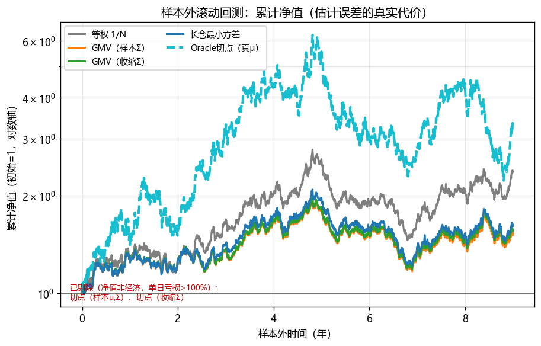

> **一图看懂**：用真实 μ 的 Oracle 组合（青色）一骑绝尘，但现实中 μ 要靠估计——朴素的等权
> 1/N（灰色）反而跑赢所有"优化"出来的组合。这正是本项目的故事主线。

## 实战决策图：该用哪种估计 / 策略

把七幕的结论浓缩成一张"遇到问题怎么选"的流程图（这正是六个实验得出的可带走结论）：

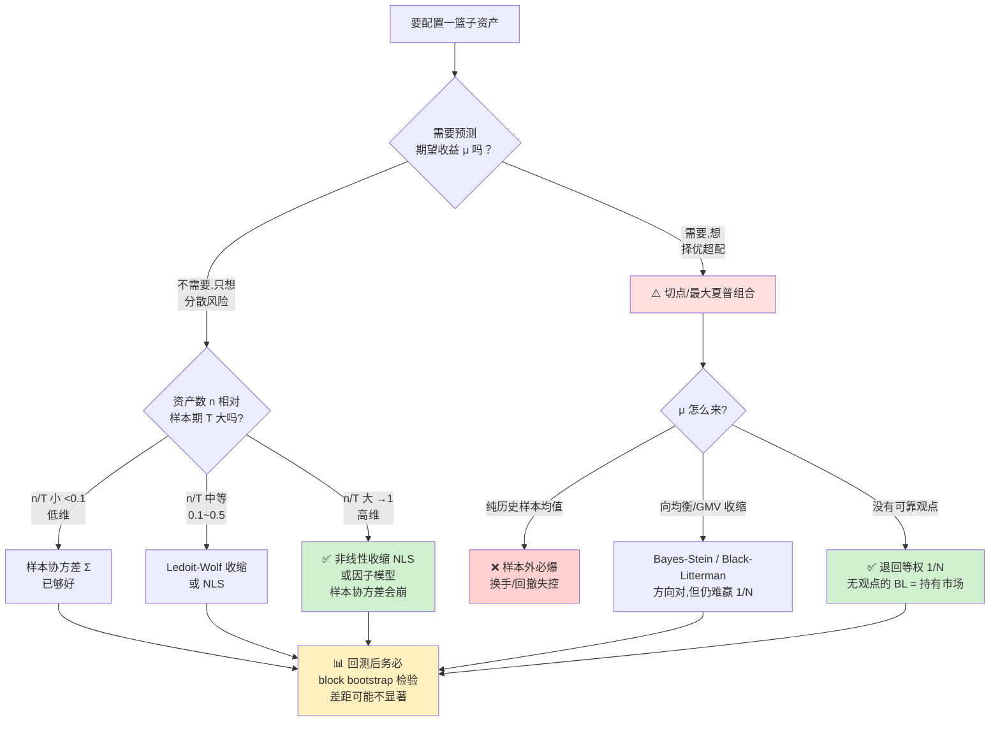

**一句话总结**：风险（Σ）能估好、且越高维越该用非线性收缩；收益（μ）几乎估不好，
所以纯优化的"最优"组合样本外往往输给朴素的等权 1/N——而且这个差距常常连统计显著性都达不到。

---

## TL;DR (English)

A from-scratch (NumPy-only) study of the Markowitz mean–variance problem as a bi-objective
program, solved from a matrix-algorithms viewpoint: closed-form efficient frontier via
**Cholesky** factorization, **projected-gradient descent with Euclidean simplex projection**
for the long-only (no-short) case, and **Ledoit–Wolf shrinkage** covariance. A strict
no-look-ahead **walk-forward backtest** then shows why the in-sample optimum fails in
practice — estimation error in `μ` collapses the max-Sharpe portfolio (OOS Sharpe goes
**negative**) while naïve **1/N wins**, reproducing DeMiguel et al. (2009). All solvers are
cross-validated against SciPy and ship with numerical self-checks (run on every push by CI).
A third act benchmarks four covariance estimators — sample, Ledoit–Wolf, **Marchenko–Pastur
eigenvalue clipping**, PCA factor — and wraps every Sharpe in **joint block-bootstrap CIs**:
on a single 9-year path, *nothing* beats 1/N significantly (not even the oracle). Act 4
treats μ itself with **Jorion's Bayes–Stein shrinkage** and the **Black–Litterman equilibrium
prior** (the no-view BL = market portfolio theorem is verified to machine precision); act 5
sweeps the universe from 8 to 200 assets and exhibits the **phase transition** where the
sample covariance collapses and RMT clipping is fully redeemed. Act 6 closes the covariance
thread with **Ledoit–Wolf (2020) analytical nonlinear shrinkage** — the L2-optimal estimator —
and a single "shrinkage-function" plot that unifies every covariance method on one axis.
Finally, an **epilogue replays all six acts on 8 real US sector ETFs** (2012–2023): the
conclusions hold with an **89% replication rate** — 1/N still wins, sample-tangency still
explodes (3370% turnover, −3206% drawdown), only hindsight-μ beats 1/N and even that isn't
significant. The findings come from the structure of the problem, not the synthetic data.

```bash
pip install -r requirements.txt
python main.py                   # Act 1 — in-sample: frontier, GMV, tangency + 6 self-checks
python experiment_backtest.py    # Act 2 — out-of-sample walk-forward backtest + 5 self-checks
python experiment_covariance.py  # Act 3 — covariance shootout (RMT) + bootstrap inference + 8 self-checks
python experiment_mu_shrinkage.py # Act 4 — Bayes-Stein & Black-Litterman for mu + 8 self-checks
python experiment_dimension.py   # Act 5 — dimension sweep n=8..200, the RMT redemption + 6 self-checks
python experiment_nls.py         # Act 6 — analytical nonlinear shrinkage, the optimal Sigma + 6 self-checks
python experiment_real.py        # Epilogue — replay on real sector ETFs + 6 self-checks
```

Full math derivation (in Chinese): [docs/derivation.pdf](docs/derivation.pdf).

---

## 六幕故事

### 第一幕 · 样本内：把优化问题手推手写一遍

| 模块 | 内容 | 矩阵算法 / ML 要点 |
|---|---|---|
| 解析法 | 拉格朗日/KKT 闭式解、有效前沿、GMV、切点组合 | **Cholesky** 分解解 SPD 系统、`A/B/C/D` 标量、前代/回代手写 |
| 数值法 | **从零实现**投影梯度下降（处理不可卖空 `w≥0`） | 概率单纯形欧氏投影（KKT 推导）、`O(1/k)` 收敛性 |
| 估计 | 样本 `μ/Σ` + **Ledoit-Wolf 收缩**协方差 | 统计学习正则化、偏差-方差权衡、条件数 |
| 数据 | 三因子模型生成的 8 资产合成日收益率 | 行业块状相关结构，离线、可复现 |

**主要结果**（合成 8 资产，年化口径，`r_f = 3%`）：

| 组合 | 年化收益 | 年化波动 | 夏普比 | 特点 |
|---|---|---|---|---|
| 全局最小方差 GMV | 6.36% | 15.34% | — | 集中于低波动金融/消费股 |
| 切点组合（最大夏普，允许卖空） | 18.54% | 32.97% | **0.471** | 做多高夏普、做空低收益资产 |
| 长仓最小方差（`w≥0`） | 6.63% | 15.38% | 0.236 | 全部非负，约束使前沿内移 |

核心算法**纯 numpy 从零实现**，并通过 6 项数值自检 + 与 **SciPy SLSQP** 的独立交叉验证
（最大权重偏差 `< 5e-6`）。详见 [`results/summary.json`](results/summary.json) 与
中文 LaTeX 数学推导：**[📄 直接看 PDF](docs/derivation.pdf)**（10 页，源文件
[`docs/derivation.tex`](docs/derivation.tex)）。

### 第二幕 · 样本外：估计误差让"最优"翻车

第一幕全是**样本内**的。现实里 `μ/Σ` 都得从历史估计，估计误差会摧毁"样本内最优"。本实验用
walk-forward 协议（估计窗 `L=252` 天、每 `R=21` 天再平衡、**严格无前视**）在 10 年合成序列上
对比 7 个策略：

| 策略 | 样本内夏普 | **样本外夏普** | 年化波动 | 最大回撤 | 平均换手 |
|---|---|---|---|---|---|
| 等权 1/N | 0.39 | **0.45** | 18.4% | −47% | 0% |
| GMV（样本Σ） | 0.23 | 0.18 | 16.1% | −41% | 6.0% |
| GMV（收缩Σ） | 0.23 | 0.20 | 16.1% | −41% | 5.6% |
| 切点（样本μ,Σ，允许卖空） | 0.48 | **−0.17** | 1009% | −3827% | 2429% |
| 切点（收缩Σ） | 0.48 | 0.37 | 483% | −110% | 1881% |
| 长仓最小方差 | 0.25 | 0.22 | 16.1% | −42% | 4.8% |
| Oracle 切点（用真 μ） | 0.48 | **0.49** | 32.5% | −64% | 12.5% |

**结论（经典 DeMiguel et al. 2009）**：样本内夏普最高的切点组合，样本外夏普塌缩到负值、
波动/回撤/换手全部爆炸；朴素的等权 1/N 反而胜过所有需要估计的优化策略。而 **Oracle 切点
（用真实 μ）样本内外都最优** —— 干净地证明问题出在 **μ 的估计误差**，而非方法本身。
Ledoit-Wolf 收缩把切点的样本外夏普从 −0.17 救回 0.37，逐期条件数也始终更良态。

| | |
|---|---|
| 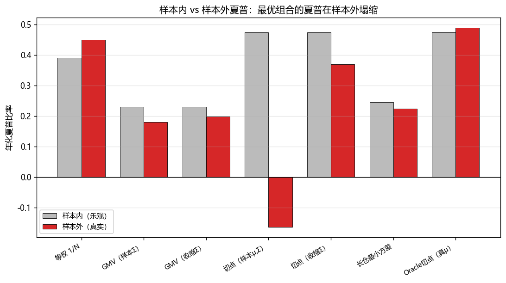 | 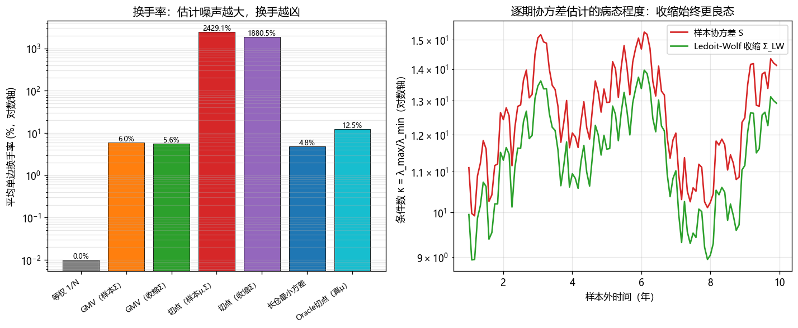 |

> 口径说明：再平衡到目标权重后持有至下期（忽略持有期内权重漂移）；切点策略不设杠杆上限，
> 故意保留其样本外失控以暴露估计误差——其单日亏损常 >100%，净值图已将其剔除（失败由表格量化）。

### 第三幕 · 把 Σ 也修好？随机矩阵理论与统计显著性

第二幕证明元凶是 μ。那 **Σ 的估计还能再好吗？回测的排名统计上可信吗？** 第三幕在同一
walk-forward 协议下让四种协方差估计同台（样本 / Ledoit-Wolf / **Marchenko-Pastur 特征值
裁剪** / PCA 因子重构），并用 **circular block bootstrap**（块长 21 天、B=2000、**联合重采**
保留策略间截面相关）给每个夏普配上 95% 置信区间、对"策略 − 1/N"的夏普差做检验：

| 策略 | 样本外夏普 | 95% CI | Δ vs 1/N | p 值 |
|---|---|---|---|---|
| 等权 1/N（基准） | **0.45** | [−0.23, 1.15] | — | — |
| GMV（样本Σ / 收缩Σ / RMT / 因子） | 0.18 / 0.20 / 0.16 / 0.09 | 均宽约 ±0.64 | −0.27 ~ −0.36 | 0.13~0.19 |
| 切点（样本 / 收缩 / RMT / 因子） | −0.17 / 0.37 / **−0.56** / 0.06 | — | −0.62 ~ −1.01 | 0.08~0.87 |
| Oracle 切点（真 μ） | 0.49 | [−0.20, 1.18] | +0.04 | 0.85 |

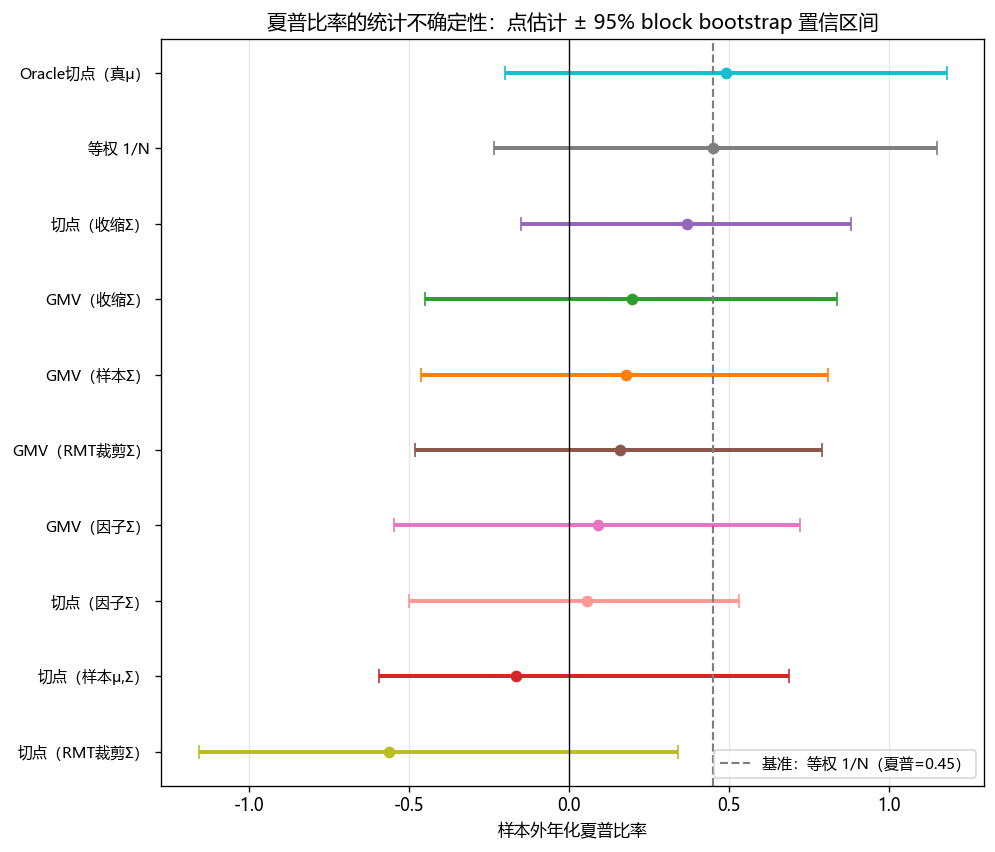

三个结论，一个比一个扎心：

1. **低维时 RMT 帮倒忙**：q = n/T = 8/252 ≈ 0.03，MP 噪声带很窄（λ₊≈1.39），全部 108 个
   滚动窗口里只有市场因子（λ≈3~4）被认定为信号——**三个真实的行业因子全部被当成噪声裁掉**，
   裁剪后的 Σ 低估行业内相关，切点组合杠杆失控（夏普 −0.56、换手 5183%）。RMT 是高维
   （n/T 大）武器，低维时样本协方差本不病态，谱手术反而误伤。
2. **GMV 档四种 Σ 差距很小**（0.09~0.20）：协方差怎么修都救不了 μ 的估计误差，与第二幕互证。
3. **没有任何策略与 1/N 的差距在 5% 水平显著**（最小 p=0.079）——单条 10 年路径的噪声大到
   **连用真实 μ 的 Oracle 都无法被统计证明跑赢等权**（p=0.85）。"回测定胜负"本身就是幻觉，
   这把 DeMiguel et al. (2009) 的结论又推进了一步。

| | |
|---|---|
| 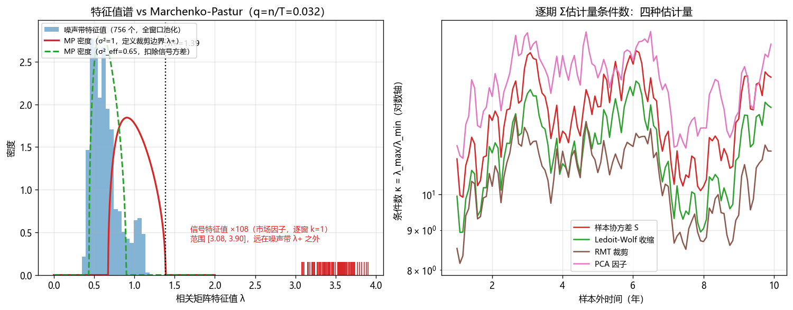 | 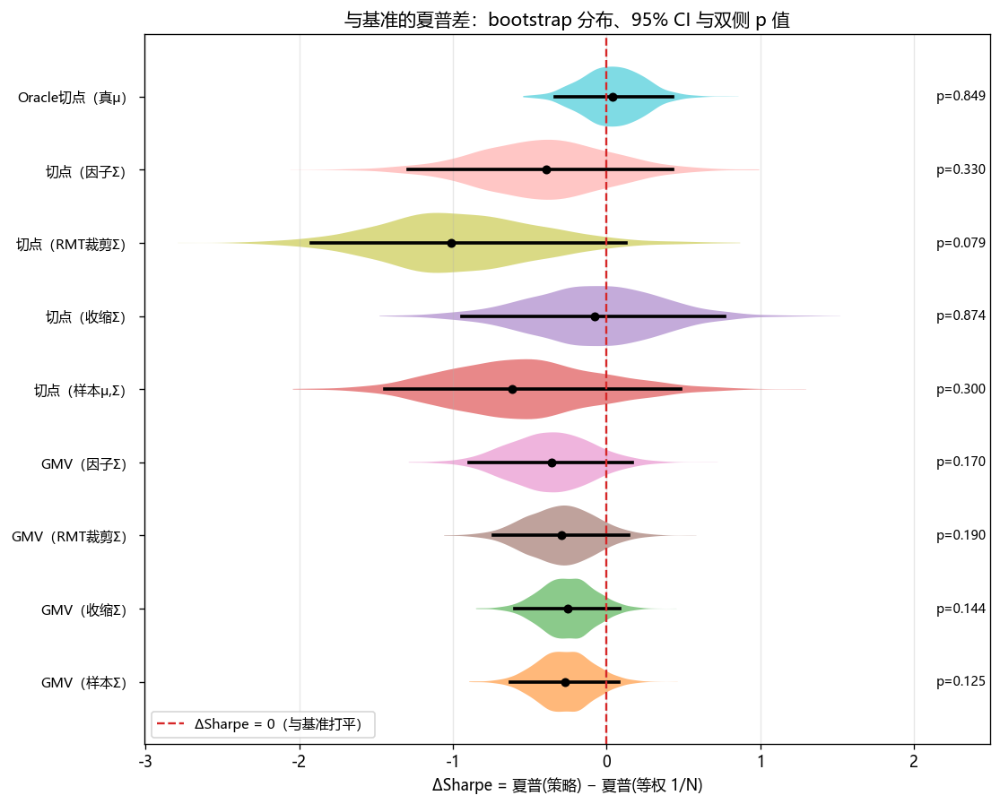 |

### 第四幕 · 给 μ 开药方：Bayes-Stein 收缩与 Black-Litterman

诊断完成，开方子。**对 μ 本身做收缩**（所有切点固定用 LW Σ，隔离 μ 的影响）：

| 策略 | 样本外夏普 | Δ vs 1/N (p 值) | 平均换手 | μ 估计误差(年化) |
|---|---|---|---|---|
| 切点（样本 μ） | 0.37 | −0.08 (0.87) | 1881% | 0.765 |
| 切点（**James-Stein** μ，Jorion 1986） | **0.40** | −0.05 (0.92) | **844%** | **0.486** |
| 切点（均衡 μ·**BL 先验**） | 0.45 | −0.00 (0.94) | **0%** | 0.397 |
| 等权 1/N（基准） | 0.45 | — | 0% | — |
| Oracle 切点（真 μ） | 0.49 | +0.04 (0.85) | 12.5% | 0 |

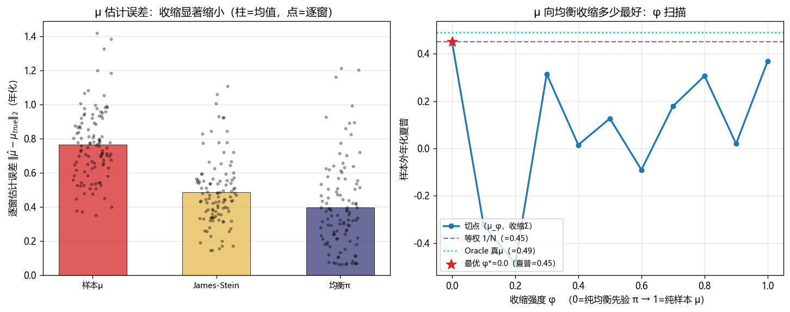

- **JS 收缩确实有效**：μ 误差砍掉 36%（0.765→0.486，99% 的窗口更优）、换手减半、夏普 0.37→0.40 ——
  方向全对，但仍追不上 1/N；
- **BL 定理的数值验证**：无观点的均衡先验切点**精确还原等权**（`max|w−1/n| = 1.2e-15`）——
  "不持有观点的贝叶斯投资者就该持有市场"，代码替教科书把这句话证了一遍；
- **φ 扫描的反直觉结论**（右图）：μ_φ = (1−φ)π + φμ̂ 从纯均衡滑向纯样本，最优在 **φ*=0**。
  且中间不是平滑过渡而是剧烈震荡——混合后的超额收益向量接近零时，切点归一化病态、权重爆炸。
  样本 μ̂ 在这条路径上**掺一分都嫌多**。

### 第五幕 · 维数相变：给 RMT 翻案

第三幕说"RMT 在 n=8 帮倒忙"，只讲了一半。固定 T=252，把资产数扫到 200（q=n/T→0.8），
数据生成过程同构、真实信号秩恒为 4，用 **GMV 样本外实现波动**（不经过 μ，纯度量 Σ̂ 质量）：

| n (q) | 样本Σ | 收缩Σ | RMT 裁剪 | PCA 因子 | 等权 |
|---|---|---|---|---|---|
| 8 (0.03) | 18.2% | 18.2% | 18.3% | 18.7% | 18.6% |
| 50 (0.20) | 14.0% | 13.8% | 13.4% | 13.2% | 17.3% |
| 100 (0.40) | 13.8% | 13.0% | 12.0% | 11.5% | 17.5% |
| 200 (0.79) | **17.5%** ↑ | 11.9% | **9.1%** | **8.8%** | 17.4% |

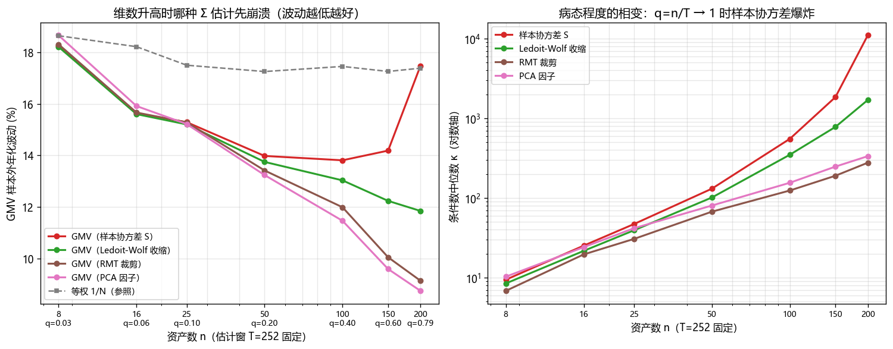

**相变清晰可见**：n=200 时样本协方差的 GMV 崩溃回 17.5%——**和闭着眼睛等权一样差，
维数带来的分散化红利被估计误差全部吃掉**（条件数中位 10994 vs LW 的 1697）；而 RMT
裁剪与 PCA 因子只保留 O(1) 个信号特征对，对维数免疫，波动一路降到 9%。第三幕与第五幕
合起来才是 RMT 的完整画像：**q 小时是手术刀误伤，q 大时是救命稻草。**

### 第六幕 · 最优协方差：Ledoit-Wolf 2017 非线性收缩

协方差线索的收尾：什么是"最好的" Σ̂？线性收缩把所有特征值朝同一个数拉、RMT 把噪声
压成台阶——都是一刀切。**非线性收缩**按 MP 理论给每个特征值施加最优的、连续变化的缩放，
是 L2 意义下最优的旋转等变估计量（特征向量不动，只最优地重标定谱）。一张"收缩函数图"
把四种方法对谱的改造并置：

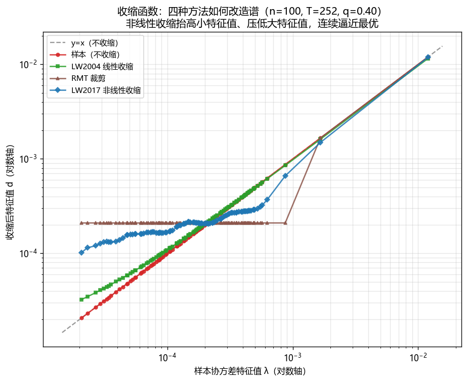

样本=贴着 `y=x`、LW2004=平移直线、RMT=台阶、**NLS=平滑最优曲线**——抬高被噪声压低的
小特征值、轻压被高估的大特征值，连续逼近 Oracle。用纯 numpy 从零实现：协方差特征分解 +
Epanechnikov 核估样本谱密度 + 其 Hilbert 变换解析式 + oracle 收缩公式。

效果（GMV 样本外实现波动，纯度量 Σ̂ 质量）：

| n (q) | 样本Σ | 收缩Σ | RMT | 因子 | **NLS** |
|---|---|---|---|---|---|
| 8 (0.03) | 16.12% | 16.09% | 16.17% | 16.69% | **16.08%** |
| 100 (0.40) | 13.81% | 13.03% | 11.99% | 11.46% | **11.83%** |
| 200 (0.79) | 17.47% ↑ | 11.85% | 9.14% | 8.75% | **9.39%** |

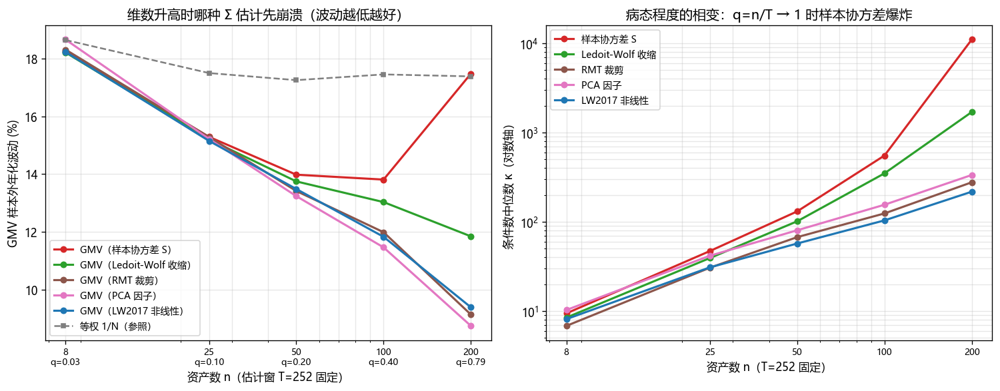

**NLS 是"从不更差"的估计量**：低维时贴着样本协方差（甚至略优，n=8 是全场 GMV 最低波动），
高维时把样本的崩溃挡下、紧贴因子/RMT 的最优表现——而它不需要像因子模型那样假设因子数、
也不像 RMT 那样在低维误伤真信号。条件数中位数 n=200 时从样本的 10994 压到 217。
**理论最优 + 无需调参 + 全维度稳健**，为协方差估计这条线画上句号。

### 尾声 · 真实数据验证：结论搬到真实市场还成立吗？

前六幕全在合成因子数据上完成。把**同一套协议、同一组策略**原封不动搬到 8 只真实美股
行业 ETF（XLK/XLF/XLE/XLV/XLP/XLY/XLI/XLU，2012–2023，[Yahoo Finance](build_real_data.py)）上：

| 策略 | 真实夏普 | Δ vs 1/N (p) | 合成夏普 | 换手 | 真实最大回撤 |
|---|---|---|---|---|---|
| 等权 1/N | **0.62** | — | 0.45 | 0% | −37% |
| GMV（样本/收缩/NLS） | 0.46 / 0.50 / 0.47 | −0.12~−0.16 (≈0.4) | 0.18~0.20 | ~14% | −33% |
| 切点（样本μ,Σ） | −0.01 | −0.63 (0.08) | −0.17 | **3370%** | **−3206%** |
| 切点（JS μ / BL μ） | 0.21 / 0.62 | −0.41 / −0.00 | 0.40 / 0.45 | 547% / 0% | −100% / −37% |
| 事后切点（全样本μ，作弊） | **0.98** | +0.36 (0.18) | 0.49 | 22% | −25% |

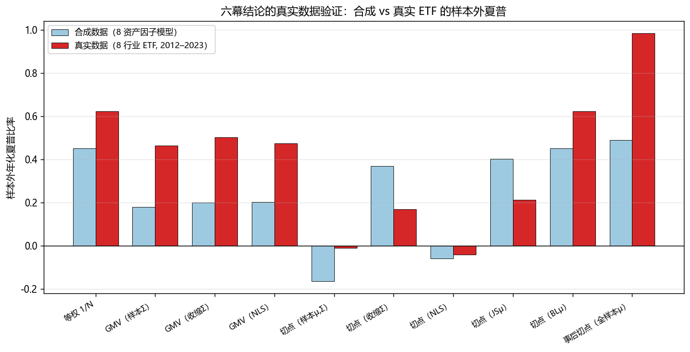

**六幕结论的复制率 89%（相对 1/N 的方向 8/9 一致）**：
- **1/N 在真实数据上依旧称王**（0.62，"诚实"策略里最高）——DeMiguel 完美复制；
- **切点（样本μ）在真实市场爆得更惨**：换手 3370%、回撤 −3206%，估计误差的代价比合成数据更触目惊心；
- **修 Σ（GMV 各版本）全簇在 1/N 之下**、**修 μ（JS/BL）把切点往 1/N 拉**——方法学结论照搬成立；
- **唯一明显超过 1/N 的是用了未来信息的"事后 μ"（0.98），但 p=0.18 仍不显著**——"连作弊都难证显著"在真实数据上同样成立。

真实数据整体夏普更高（2012–2023 是大牛市），但**相对排名与合成数据高度吻合**——说明六幕的结论
来自均值-方差问题的结构本身，而非合成数据的特例。这给整个项目补上了最后一块拼图。

---

## 如何运行

```bash
# 1. 安装依赖（numpy / matplotlib / pandas；scipy 仅用于交叉验证）
pip install -r requirements.txt

# 2. 第一幕——样本内：生成数据、求解、出 5 张图、跑自检、导出结果
python main.py

# 3. 第二幕——样本外：滚动回测，出 4 张图、导出 backtest_summary.json
python experiment_backtest.py

# 4. 第三幕——协方差擂台（RMT）+ bootstrap 显著性，出 3 张图、导出 covariance_summary.json
python experiment_covariance.py

# 5. 第四幕——μ 收缩（Bayes-Stein / Black-Litterman），出 3 张图、导出 mu_summary.json
python experiment_mu_shrinkage.py

# 6. 第五幕——维数扫描 n=8..200，出 2 张图、导出 dimension_summary.json
python experiment_dimension.py

# 7. 第六幕——非线性收缩（LW2017），出 3 张图、导出 nls_summary.json
python experiment_nls.py

# 8. 尾声——真实 ETF 数据验证，出 3 张图、导出 real_summary.json
#    （data/returns_real.csv 已入库；重新下载数据：python build_real_data.py，需联网）
python experiment_real.py

# 9.（可选）编译中文数学推导 PDF（需 xelatex，运行两遍以生成目录/交叉引用）
cd docs && xelatex derivation.tex && xelatex derivation.tex
```

> Windows 提示：图像中文字体用系统自带的 Microsoft YaHei / SimHei；控制台中文若乱码，
> 脚本已自动把 stdout 切到 UTF-8。全流程随机种子固定（`seed=42`），结果可复现。

## 目录结构

```
.
├── README.md                   本文件
├── LICENSE                     MIT
├── .github/workflows/ci.yml    CI：每次 push 自动跑两幕全部 11 项自检
├── requirements.txt            依赖
├── main.py                     第一幕：数据→估计→解析/数值求解→图像→自检→导出
├── experiment_backtest.py      第二幕：样本外滚动回测 + 自检
├── experiment_covariance.py    第三幕：协方差擂台（RMT）+ bootstrap 显著性 + 自检
├── experiment_mu_shrinkage.py  第四幕：μ 收缩（Bayes-Stein/BL）+ φ 扫描 + 自检
├── experiment_dimension.py     第五幕：维数扫描 n=8..200（RMT 翻案）+ 自检
├── experiment_nls.py           第六幕：非线性收缩（LW2017 最优 Σ）+ 收缩函数图 + 自检
├── experiment_real.py          尾声：真实 ETF 数据验证（合成 vs 真实）+ 自检
├── build_real_data.py          真实数据下载+构建（Yahoo Finance，溯源用，需联网）
├── src/
│   ├── generate_data.py        三因子模型合成收益率（8 资产 + 任意 n 宇宙，含真实 μ）
│   ├── data_utils.py           μ/Σ 估计：LW 收缩、MP 裁剪、PCA 因子、JS 收缩、BL 先验、NLS
│   ├── analytic.py             解析法（Cholesky、闭式前沿、GMV、切点）
│   ├── numeric.py              数值法（投影梯度下降 + 单纯形投影）
│   ├── backtest.py             样本外滚动回测引擎 + 策略注册表（可插拔 μ/Σ 估计量）
│   ├── bootstrap.py            circular block bootstrap（联合重采、夏普差检验）
│   ├── metrics.py              收益/风险/夏普 + 回撤/换手/年化统计
│   └── plots.py                全部图像绘制（23 张）
├── figures/                    23 张输出图（运行后生成）
├── results/                    7 份 *_summary.json（各实验结果 + 自检）
├── data/                       合成 + 真实 ETF 日收益率 CSV
└── docs/
    ├── derivation.tex          中文数学推导（ctex + xelatex）
    └── derivation.pdf          编译产物
```

## 交付物对应

1. **数学推导（LaTeX）**：[docs/derivation.tex](docs/derivation.tex) → [docs/derivation.pdf](docs/derivation.pdf)
2. **代码**：[main.py](main.py) + 六个实验驱动 + 真实数据验证 + [src/](src/)（核心算法纯 numpy 从零实现，45 项数值自检）
3. **图像**：[figures/](figures/) 共 23 张（样本内 5 + 回测 4 + 协方差/bootstrap 3 + μ 收缩 3 + 维数 2 + 非线性收缩 3 + 真实数据 3）
4. **现实问题落地**：从抽象矩阵优化到"如何配一篮子股票"，六幕依次回答"最优为何翻车 →
   修 Σ 行不行 → 结论显著吗 → 修 μ 行不行 → 适用边界在哪 → 什么是理论最优 Σ"，尾声用真实 ETF 验证全部结论

## 参考

- Markowitz (1952), *Portfolio Selection*.
- Ledoit & Wolf (2004), *A well-conditioned estimator for large-dimensional covariance matrices*.
- DeMiguel, Garlappi & Uppal (2009), *Optimal Versus Naive Diversification*.
- Marchenko & Pastur (1967), *Distribution of eigenvalues for some sets of random matrices*.
- Bouchaud & Potters (2011), *Financial applications of random matrix theory: a short review*.
- Politis & Romano (1992), *A circular block-resampling procedure for stationary data*.
- Jorion (1986), *Bayes-Stein estimation for portfolio analysis*.
- Black & Litterman (1992), *Global Portfolio Optimization*.
- Ledoit & Wolf (2020), *Analytical Nonlinear Shrinkage of Large-Dimensional Covariance Matrices*.

## License

[MIT](LICENSE) © 2026 忽哲
