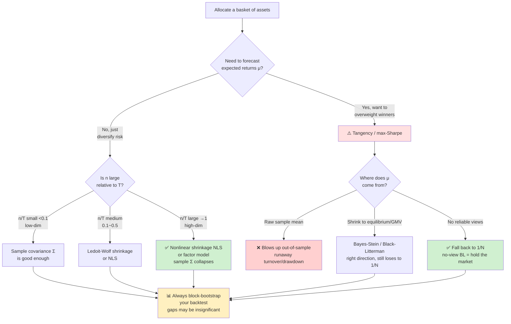

# Mean–Variance Portfolio Optimization: Matrix Algorithms, From-Scratch Solvers & Out-of-Sample Reality

> Built entirely with NumPy, studied from a **matrix-algorithms** viewpoint, then stress-tested across six experiments and validated on real ETF data.

[](https://github.com/hhzz-svg/mean-variance-portfolio/actions/workflows/ci.yml)


**🌐 Language**: English (this page) · **[中文](README.md)** ｜ **📓 [Overview Notebook](overview.ipynb)** (read all seven acts in one file)

The classic Markowitz mean–variance problem, framed as a **bi-objective program** (maximize
return `μᵀw`, minimize risk `wᵀΣw`) and solved from a matrix-algorithms perspective: closed-form
efficient frontier via **Cholesky**, from-scratch **projected-gradient descent with simplex
projection** for the long-only case, and a full ladder of covariance/mean estimators. Six
interlocking experiments take the model apart and put it back together; an epilogue replays
everything on real US sector ETFs.


> **The one-chart story**: the oracle tangency portfolio (cyan, using the *true* μ) dominates,
> but in reality μ must be estimated — and the naïve equal-weight 1/N (grey) beats every
> "optimized" portfolio.

## Decision guide: which estimator / strategy to use

The takeaway from all six experiments, distilled into one flowchart:



**In one sentence**: risk (Σ) is estimable — the higher-dimensional, the more you need
nonlinear shrinkage; return (μ) is nearly inestimable, so "optimal" portfolios routinely lose
out-of-sample to plain 1/N — and that gap often fails to even reach statistical significance.

## Quick start

```bash
pip install -r requirements.txt
python main.py                    # Act 1 — in-sample: frontier, GMV, tangency + 6 self-checks
python experiment_backtest.py     # Act 2 — out-of-sample walk-forward backtest + 5 self-checks
python experiment_covariance.py   # Act 3 — covariance shootout (RMT) + bootstrap inference + 8 self-checks
python experiment_mu_shrinkage.py # Act 4 — Bayes-Stein & Black-Litterman for μ + 8 self-checks
python experiment_dimension.py    # Act 5 — dimension sweep n=8..200, the RMT redemption + 6 self-checks
python experiment_nls.py          # Act 6 — analytical nonlinear shrinkage, the optimal Σ + 6 self-checks
python experiment_real.py         # Epilogue — replay on real sector ETFs + 6 self-checks
```

All randomness is seeded (`seed=42`); every script's exit code is tied to its numerical
self-checks (45 in total), which CI runs on every push. Plots use system CJK fonts on Windows.

## The seven acts

### Act 1 · In-sample: solve it from scratch

| Module | Content | Matrix-algorithm focus |
|---|---|---|
| Analytic | Lagrange/KKT closed form, efficient frontier, GMV, tangency | **Cholesky** solve of SPD systems, `A/B/C/D` scalars, hand-written forward/back substitution |
| Numeric | **from-scratch** projected gradient descent (long-only `w≥0`) | Euclidean projection onto the simplex (KKT-derived), `O(1/k)` convergence |
| Estimation | sample `μ/Σ` + **Ledoit-Wolf shrinkage** | statistical-learning regularization, bias–variance, condition number |

Core algorithms are pure NumPy, cross-validated against **SciPy SLSQP** (max weight deviation
`< 5e-6`). See [docs/derivation.pdf](docs/derivation.pdf) for the full derivation.

### Act 2 · Out-of-sample: estimation error breaks the optimum

Strict no-look-ahead walk-forward (estimate on `L=252` days, rebalance every `R=21`):

| Strategy | In-sample Sharpe | **OOS Sharpe** | Vol | Max DD | Turnover |
|---|---|---|---|---|---|
| Equal-weight 1/N | 0.39 | **0.45** | 18.4% | −47% | 0% |
| Tangency (sample μ,Σ, shorting) | 0.48 | **−0.17** | 1009% | −3827% | 2429% |
| Oracle tangency (true μ) | 0.48 | **0.49** | 32.5% | −64% | 12.5% |

The max-Sharpe portfolio's Sharpe **collapses to negative** out-of-sample while 1/N wins —
reproducing DeMiguel et al. (2009). The oracle (true μ) stays optimal, pinning the culprit on
**μ estimation error**.

### Act 3 · Fix Σ? Random matrix theory + significance

Four covariance estimators (sample / Ledoit-Wolf / **Marchenko-Pastur clipping** / PCA factor)
on the same protocol, each Sharpe wrapped in **joint circular block-bootstrap CIs**. Findings:
(1) at q = n/T ≈ 0.03 the MP noise band is narrow, RMT clips real sector factors and *hurts*;
(2) GMV variants barely differ — fixing Σ can't fix μ; (3) **no strategy beats 1/N
significantly** (min p=0.079) — on a single 9-year path, even the oracle can't be proven to win.

### Act 4 · Fix μ: Bayes-Stein & Black-Litterman

| Strategy | OOS Sharpe | Turnover | μ error (annual) |
|---|---|---|---|
| Tangency (sample μ) | 0.37 | 1881% | 0.765 |
| Tangency (**James-Stein** μ) | **0.40** | **844%** | **0.486** |
| Tangency (**Black-Litterman** prior) | 0.45 | 0% | 0.397 |
| Equal-weight 1/N | 0.45 | 0% | — |

JS shrinkage cuts μ error by 36% and halves turnover (right direction, still can't catch 1/N).
The **no-view BL theorem** — equilibrium-implied tangency ≡ equal weight — is verified to
machine precision (`max|w − 1/n| = 1.2e-15`). A φ-sweep of `μ_φ = (1−φ)π + φμ̂` peaks at
**φ*=0** (pure equilibrium): sample μ̂ is harmful in any dose here.

### Act 5 · Dimensional phase transition: RMT redeemed

Fix T=252, sweep n from 8 to 200 (q → 0.79), measured by GMV out-of-sample realized vol:

| n (q) | Sample Σ | NLS / RMT / Factor |
|---|---|---|
| 8 (0.03) | 18.2% | ~18.3% |
| 200 (0.79) | **17.5% ↑ collapses** | **~9%** |

At n=200 the sample covariance's GMV is **as bad as blind equal-weight** (condition number
median 10994); RMT and factor estimators keep only O(1) signal eigenpairs and are
dimension-immune. Acts 3+5 give the full picture: **RMT is a scalpel that nicks real factors
at low dimension, and a lifeline at high dimension.**

### Act 6 · The optimal Σ: Ledoit-Wolf analytical nonlinear shrinkage

Linear shrinkage pulls all eigenvalues toward one number; RMT flattens noise into a step.
**Nonlinear shrinkage** applies the optimal, continuously-varying scaling to each eigenvalue
(L2-optimal rotation-equivariant estimator). One "shrinkage-function" plot unifies all methods:


Implemented from scratch (eigendecomposition + Epanechnikov-kernel spectral density + its
Hilbert transform + oracle formula). NLS is **never worse**: it hugs the sample covariance at
low dimension and the factor-model optimum at high dimension, with no tuning and no false
clipping — closing the covariance thread.

### Epilogue · Real-data validation

Replaying the same protocol on **8 real US sector ETFs** (XLK/XLF/XLE/XLV/XLP/XLY/XLI/XLU,
2012–2023, via [build_real_data.py](build_real_data.py)):

| Strategy | Real Sharpe | Δ vs 1/N (p) | Synthetic Sharpe | Real Max DD |
|---|---|---|---|---|
| Equal-weight 1/N | **0.62** | — | 0.45 | −37% |
| GMV (sample/shrink/NLS) | 0.46–0.50 | ≈−0.13 (~0.4) | 0.18–0.20 | −33% |
| Tangency (sample μ,Σ) | −0.01 | −0.63 (0.08) | −0.17 | **−3206%** |
| Hindsight tangency (cheating μ) | **0.98** | +0.36 (0.18) | 0.49 | −25% |


**89% replication rate** (sign of Δ vs 1/N agrees for 8/9 strategies): 1/N still wins,
sample-tangency explodes even harder (3370% turnover, −3206% drawdown), Σ-fixes stay below 1/N,
and only the future-peeking hindsight μ beats 1/N — yet still not significantly (p=0.18). The
conclusions come from the **structure of the mean–variance problem**, not the synthetic data.

## Repository layout

```
.
├── README.md / README_EN.md     bilingual project overview
├── overview.ipynb               single-file walkthrough of all seven acts
├── main.py                      Act 1 driver
├── experiment_*.py              Acts 2–6 + real-data epilogue (6 drivers)
├── build_real_data.py           real ETF data download + build (provenance)
├── src/
│   ├── generate_data.py         factor-model synthetic returns (8 assets + arbitrary-n universe)
│   ├── data_utils.py            estimators: LW shrink, MP clip, PCA factor, JS shrink, BL prior, NLS
│   ├── analytic.py              Cholesky, closed-form frontier, GMV, tangency
│   ├── numeric.py               projected gradient descent + simplex projection
│   ├── backtest.py              walk-forward engine + pluggable μ/Σ estimators
│   ├── bootstrap.py             circular block bootstrap (joint resampling, Sharpe-diff test)
│   ├── metrics.py               return/risk/Sharpe + drawdown/turnover
│   └── plots.py                 all figures (23)
├── figures/                     23 output figures
├── results/                     7 *_summary.json (results + self-checks)
├── data/                        synthetic + real ETF return CSVs
└── docs/                        derivation.tex / derivation.pdf (Chinese, 13 pages)
```

## References

- Markowitz (1952), *Portfolio Selection*.
- Ledoit & Wolf (2004), *A well-conditioned estimator for large-dimensional covariance matrices*.
- DeMiguel, Garlappi & Uppal (2009), *Optimal Versus Naive Diversification*.
- Marchenko & Pastur (1967); Bouchaud & Potters (2011), RMT in finance.
- Politis & Romano (1992), *A circular block-resampling procedure for stationary data*.
- Jorion (1986), *Bayes-Stein estimation for portfolio analysis*.
- Black & Litterman (1992), *Global Portfolio Optimization*.
- Ledoit & Wolf (2020), *Analytical Nonlinear Shrinkage of Large-Dimensional Covariance Matrices*.

## License

[MIT](LICENSE) © 2026 忽哲
